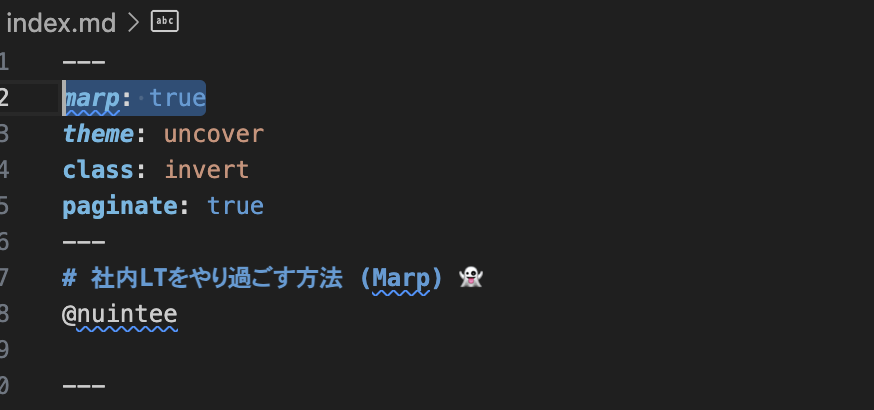
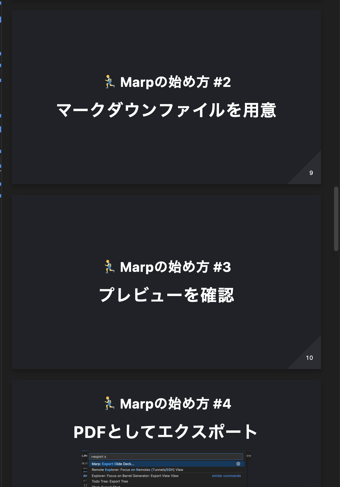
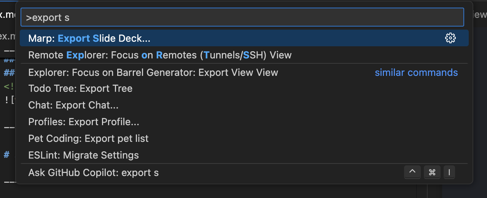

# 社内LTをやり過ごす方法 (Marp) 👻
@nuintee

---

# こんな悩みはありませんか？
1. 💭 LTに参加したいけど**アイデアが浮かばない**

2. ⏰ LTのスライドを準備する**時間が無い**

---

# 🤔 それ...Marpで解決できます

---

# Marpとは?
### Markdownから**プレゼンテーションスライドを生成**してくれるツール

---

# Marpの特徴
1. 🐆 **すぐに使える**  
- Markdownが書ければ、そのままスライドが作れます
2. 👨‍🎨 **スタイル調整不要**  
  - 「uncover」「gaia」など、おしゃれなテーマが標準装備
---

# 😹 難しい事は不要！
速く、綺麗に、簡単に

---

# 🏃‍♂️ Marpの始め方

---

### 🏃‍♂️ Marpの始め方 #1
## ✍️ [Marp for VS Code](https://marketplace.visualstudio.com/items?itemName=marp-team.marp-vscode)を導入
VSCode・Cursor以外の人はすみません

---

### 🏃‍♂️ Marpの始め方 #2
## マークダウンファイルを作成

---

### 🏃‍♂️ Marpの始め方 #3
## Marpを有効化

<small>💡マークダウンの先頭に `marp: true`を追加</small>

---

### 🏃‍♂️ Marpの始め方 #4
## マークダウンファイルを書く

詳しい記述は[こちら](https://qiita.com/tomo_makes/items/aafae4021986553ae1d8)が参考になります

---

#### 🏃‍♂️ Marpの始め方 #5
### プレビューを確認

<small>💡 コマンドパレット検索: `Markdown: Open Preview`</small>

---

### 🏃‍♂️ Marpの始め方 #5
## pptxとしてエクスポート

<small>💡 コマンドパレット検索: `Marp: Export Slide Deck`</small>

---

# 以上！

---

## ⚡️ 社内LTをやり過ごすテクニック 
## (本題)

---

### ⚡️ 社内LTをやり過ごすテクニック #1
# スライド作り自体の話をする
スライドを作る技術に関してのスライドなのでOK (?)  

---

### ⚡️ 社内LTをやり過ごすテクニック #2
# 小洒落たテーマを使用する
**uncover** テーマで "雰囲気"を演出

---

### ⚡️ 社内LTをやり過ごすテクニック #3
# 絵文字をふんだんに使用する
やった感を出しましょう

---

### ⚡️ 社内LTをやり過ごすテクニック #4
# 時間稼ぎ
余計なスライドでかさ増し

---

### 🚨 LTをやり過ごす際の注意点
# メタなので1回しか使えない

---

# 終わりに
~ LTの内容はちゃんと考えましょう ~

---

<!-- 終了スライド -->
# ご清聴ありがとうございました 👋

~ 📚 本スライドの[リポジトリ](https://github.com/nuintee/lt-marp)も公開中です〜